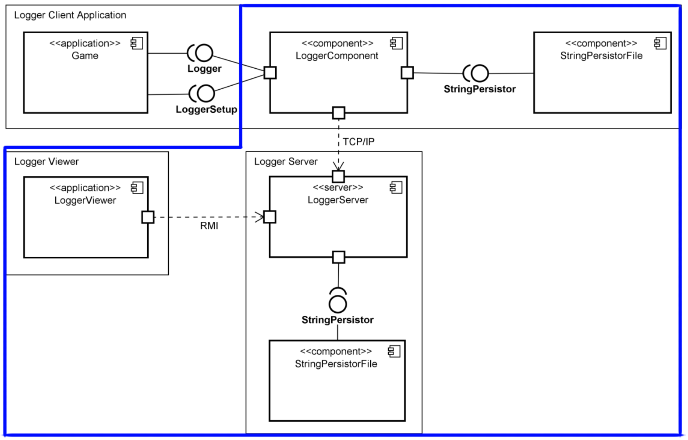
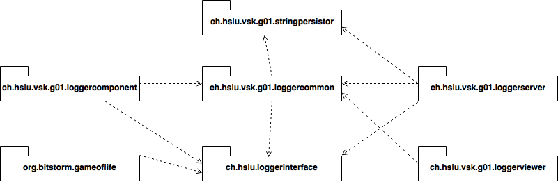
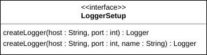

# Systemspezifikationen

<!--always update PDF after editing-->

**Teammitglieder**:

* Christopher Christensen
* Valentin Bürgler
* Lukas Arnold
* Melvin Werthmüller

**Versionsverlauf**:

| Rev. | Datum    | Autor                   | Bemerkungen                                    | Status |
|:-----|:---------|:------------------------|:-----------------------------------------------|:-------|
| 1.1  | 24.10.17 | Valentin Bürgler        | Erster Entwurf                                 | done   |
| 1.2  | 31.10.17 | Christopher Christensen | Erweiterung Kap.1/2                            | done   |
| 1.3  | 01.11.17 | Valentin Bürgler        | Bearbeitung Kap.2/4                            | done   |
| 1.4  | 03.11.17 | Valentin Bürgler        | Bearbeitung Kap.1/3, Diagramme + `config`-File | done   |
| 1.5  | 05.11.17 | Christopher Christensen | Für Zwischenabgabe prüfen                      | done   |
| 1.6  | 05.11.17 | Valentin Bürgler        | Überarbeitung aller Kapitel                    | done   |
| 2.0  | 06.11.17 | Christopher Christensen | Aufbereitung für Merge mit alter Dokumentation | done   |
| 2.1  | 10.11.17 | Christopher Christensen | Merge SysSpec mit alter Dokumentation          | done   |
| 2.2  | 10.11.17 | Christopher Christensen | LogFile.txt Specs added                        | done   |
| 2.3  | 10.11.17 | Melvin Werthmüller      | Content organisation                           | done   |
| 2.4  | 10.11.17 | Melvin Werthmüller      | LoggerServer specs updated                     | done   |
| 2.5  | 10.11.17 | Christopher Christensen | einige TODOs erledigt                          | done   |
| 2.6  | 15.11.17 | Lukas Arnold            | Erklärungen zu diversen Punkten erweitert      | done   |
| 2.7  | 16.11.17 | Valentin Bürgler        | Patterns beschrieben                           | done   |
| 2.8  | 17.11.17 | Valentin Bürgler        | UMLs zu Patterns eingefügt                     | done   |
| 2.9  | 17.11.17 | Valentin Bürgler        | Überarbeitung aller Referenzen auf Singleton   | done   |
| 3.0  | 17.11.17 | Lukas Arnold            | Explain LoggerViewer and RMI-Connection        | done   |
| 3.1  | 22.11.17 | Melvin Werthmüller      | Anpassungen Aufgabenstellung V2 vorbereitet    | done   |
| 3.2  | 27.11.17 | Melvin Werthmüller      | Anpassungen Beschreibung Logger Client         | done   |
| 3.3  | 27.11.17 | Lukas Arnold            | gleichzeitige Verbindungen besser erklärt      | done   |
| 3.4  | 27.11.17 | Lukas Arnold            | Systemübersicht aktualisiert                   | done   |
| 3.5  | 27.11.17 | Christopher Christensen | Anpassungen StringPersistor/LogFileAdapter     | done   |
| 3.6  | 28.11.17 | Melvin Werthmüller      | Kapitel zu Diskussionen bezüglich Entscheide   | done   |
| 3.7  | 04.12.17 | Christopher Christensen | LogConverterStrategy zur Doku hinzugefügt      | done   |
| 3.8  | 05.12.17 | Lukas Arnold            | Remove comments and fix wrong version number   | done   |
| 3.9  | 08.12.17 | Melvin Werthmüller      | Anpassungen zur Aufgabenstellung v2            | done   |

****

## 1 Systemübersicht

### 1.1 Grobe Systemübersicht


Es soll eine Logger-Komponente implementiert werden, die eingebunden in eine bestehende Java-Applikation über Methodenaufrufe Meldungen aufzeichnet, welche dann per TCP/IP an einen Logger-Server gesendet werden, wo sie in einem wohldefinierten Format gespeichert werden. Falls die Verbindung zum Server unterbrochen wird, so werden die Meldungen temporär in ein File auf dem Client gespeichert. Diese werden dann bei erneuter Verbindung übermittelt.

Sinnvolle Ereignisse und Situationen, die geloggt werden müssen, sind zu definieren und die entsprechenden Aufrufe in der Java-Applikation zu integrieren.

Die durch ein Interface-Team definierten LogLevels sind sinnvoll und konsistent zu nutzen. Weiter sind die vorgegebenen Schnittstellen Logger, LoggerSetup und StringPersistor einzuhalten. Es müssen sich mehrere Clients mit einem Server verbinden können.

Zusätzlich soll ein Viewer per RMI vom Server über eine neue Meldung benachrichtig werden. Der Viewer zeigt dann alle Meldungen an, welche beim Server ankommen.

### 1.2 Vollständige Systemübersicht
Das folgende UML soll eine detaillierte Übersicht über das implementierte System schaffen.


<span style="color:red">TODO Systemübersicht aktualisieren</span>

****

### 1.3 Ablauf auf dem Client
In der Applikation instanziiert das Singleton `MessageLogger` einmalig über seine statische `getInstance`-Methode mit der `LoggerFactory` eine spezifische `Logger`-Implementierung und stellt diese dann zur Verfügung. Diese `Logger`-Implementation bietet dann Methoden um einen `String` oder ein `Throwable` mit dem entsprechenden `LogLevel` zu loggen. Damit die Verbindung asynchron ist, werden zuerst alle zu loggenden Meldungen mit einem eigenen Thread `LogProducer` in eine Queue geschrieben. Des Weiteren ist ein Thread `LogConsumer` dafür zuständig die Queue zu lesen und die Meldungen über eine TCP Verbindung zum Server zu schicken. Falls die Objekte nicht an den Server geschickt werden können, werden diese mit dem `StringPersistor` in ein temporäres TextFile geschriben. Sobald die Verbindung wieder vorhanden ist, werden zuerst die Meldungen aus dem TextFile an den Server geschickt, bevor neue Meldungen übermittelt werden.

### 1.4 Ablauf auf dem Server
Der Server stellt einen Socket bereit und empfängt Meldungen vom Client. Für das Empfangen sind dabei mehere `SocketHandler` (Standard-Konfiguration sind 10) zuständig. Jeder dieser `SocketHandler` hält die Verbindung zu einem Client. In der Standard-Konfiguration sind so maximal 10 Clients gleichzeit möglich, welche mit dem gleichen Server kommunizieren. Für jede erhaltene Nachricht wird ein eigener `LogHandler` erstellt, welcher die Meldungen asynchron an den Adapter zum Stringpersistor weitergibt und an die `RmiRegistry`-Thread sendet. Der Stringpersistor ermöglicht es dem `LogHandler` (via `LogWriterAdapter`) über die `save`-Methode eine Zeitinstanz mit einer Log-Message in ein Log-File zu schreiben. Das File wird durch einen Aufruf der Methode `setFile` im Logger-Server definiert. Die `RmiRegistry` sendet die Meldung dann weiter an den RMI-Server, welcher sie an alle angemeldeten Clients verteilt.

****

## 2 Architektur und Designentscheide
Wir versuchten, möglichst viele bewährte objektorientierte Entwurfsmuster zu verwenden, um eine saubere Architektur unseres MessageLoggers zu erreichen.


### 2.1 Modelle und Sichten
#### Packetdiagramm


#### Klassendiagramm


<span style="color:red">TODO: aktualisieren</span>

### 2.2 Entwurfsentscheide
Wir haben generell über das Projekt hinweg versucht uns an den Clean-Code-Prinzipien zu orientieren. Wir versuchten Vererbung zu vermeiden und das «Favour Composition over Inheritance»-Prinzip zu verfolgen. Dazu strebten wir an die Wiederverwendbarkeit zu erhöhen indem wir das DRY-Prinzip vor Augen hielten und die einzelnen Komponenten so zu gestalten, dass sie nur jeweils eine Aufgabe erfüllen (Seperation of Concerns).

#### Singleton-Pattern


Das Singleton-Erzeugungsmuster wird für die Verwendung der Logger-Komponente durch das Spiel folgendermassen eingesetzt:
Das Singleton ist die im Spiel-Package hinzugefügte Klasse `MessageLogger`. Dieses hält ein privates, statisches Attribut `instance` vom Interface-Typ `Logger`. Dessen einmalige Instanziierung und der globale Zugriff darauf wird vom Singleton über die statische Methode `getInstance()` geboten. Die Klassen des Spiels, die etwas loggen sollen, halten diese Instanz in einer hinzugefügten privaten Klassenvariabel. Dadurch kann von überall aus im Spiel auf die Logger-Komponente zugegriffen werden.

#### Fabrikmethode-Pattern


Bei der Erzeugung der `Logger`-Implementation, die vom Spiel verwendet wird, kommt die Fabrikmethode als Erzeugungsmuster zum Einsatz: 
Das Produkt ist vom Interface-Typ `Logger`. Der Erzeuger vom Interface-Typ `LoggerSetup` deklariert die Fabrikmethode `getLoggerSetup`, um ein solches Produkt zu erzeugen. Das konkrete Produkt `BaseLogger` implementiert die Produkt-Schnittstelle (`Logger`-Interface). Der konkrete Erzeuger `LoggerFactory` überschreibt die Fabrikmethode `getLoggerSetup`, um das konkrete Produkt, also den `BaseLogger` zu erzeugen.

#### Strategie-Pattern 1


Bei der Einbindung der Logger-Komponente im Spiel wurde das Strategie-Verhaltensmuster wie folgt eingesetzt:
Der Klient ist das Spiel. Den Kontext bildet die im Spiel-Package zusätzlich eingefügte Klasse `MessageLogger`. Die Strategie ist vom Interface-Typ `Logger` und wird in der Instanz-Variabel `instance` vom Kontext gehalten. Dies ermöglicht es, die Strategie mit einer anderen Logger-Komponente auszutauschen.

#### Strategie-Pattern 2


Das Strategie-Pattern wurde ebenfalls verwendet, um die `LogMessage`-Objekte in verschiedenen String-Formaten abspeichern zu können. Der `LogFileAdapter` verwendet das `LogSemicolonConverterStrategy`-Interface, welches das `LogConverterStrategy` implementiert. Im folgenden Code-Abschnitt sieht man den Konstruktor der Klasse `LogFileAdapter`, welche auch das Attribut `private LogConverterStrategy strategy` besitzt. 

```java
public LogFileAdapter(String filename) throws ClassNotFoundException, 
IllegalAccessException, InstantiationException {
        
        Class persistor = Class.forName("ch.hslu.vsk.g01.stringpersistor.StringPersistor");
        this.stringPersistor = (StringPersistor) persistor.newInstance();

        this.file = new File(filename);
        this.stringPersistor.setFile(this.file);
        
        this.strategy = new LogSemicolonConverterStrategy();
        
    }

```

Anstelle der `LogSemicolonConverterStrategy`-Klasse könnte der `LogFileAdapter` die Klasse `LogSlashConverterStrategy` verwenden, welches ebenfalls das Interface `LogConverterStrategy` implementiert. Dies würde man dann nur im Konstruktor des `LogFileAdapter` ändern.

```java 
this.strategy = new LogSlashSemicolonConverterStrategy();
```

#### Adapter-Pattern
Das Adapter-Muster ist ein Strukturmuster und übersetzt eine Schnittstelle in eine andere. Dadurch kann die Kommunikation einer Klasse zu einer inkompatiblen Schnittstellen ermöglicht werden und gleichzeitig eine lose Kopplung gewährleisten.

**Akteure**: 

* `LogConsumer` verwendet `LogFileAdapter`
* `LogHandler` verwendet `LogFileAdapter`
* `LogFileAdapter` adaptiert `StringPersistor`

Wir verwenden das Adapter Pattern an zwei Stellen in unserem MessageLogger: 

* Ist der Server vom Client nicht erreichbar, müssen die `LogMessage`-Objekte vorübergehend beim Client gespeichert werden. Der Client macht dies, indem der `LogConsumer` den `LogFileAdapter` verwendet, um die `LogMessage`-Objekte in ein lokales Textfile zu schreiben. Der `LogFileAdapter` adaptiert den `StringPersistor` mit der Methode `void writeLogMessage(LogMessage logMessage)`. Der `StringPersistor` schreibt die Nachrichten dann mit der Methode `void save(Instant timestamp, String payload)` effektiv in das TextFile. Sobald die Verbindung wieder hergestellt wurde nutzt der LogConsumer den `LogFileAdapter` erneut, um mit der Methode `List<LogMessage> readLogMessages()` alle Nachrichten wieder aus dem `File` zu lesen. Hier wird die `StringPersistor`-Methode `List<PersistedString> get(int i)` adaptiert, welche die Nachrichten effektiv aus dem `File` liest.


* Für die Übertragung der `LogMessage` vom `LogHandler` zum `StringPersistor`, verwenden wir ebenfalls das Adapter-Modell (`LogFileAdapter`). So kann die Implementation der `StringPersistor`-Klasse ungeändert bleiben und wir können eine angepasste Implementation für den `LogHandler` erstellen. Dadurch erhalten wir die effektiv gewünschte Zielschnittstelle und die `LogMessage`-Objekte werden wie gewollt auf serverseite in ein `LogMessage`-`File` geschrieben.


#### Konfigurationsdateien
Die Konfigurationsdateien entsprechen einem Java-Properties-File. Wie ein soclhes File aufgebaut ist kann man unter der folgenden Adresse nachlesen: https://de.wikipedia.org/wiki/Java-Properties-Datei. In diesem Projekt werden die zwei Konfigurationsdateien `client.properties` und `server.properties` eingesetzt, welche zur Konfiguration des Loggers im Game und des Servers verwendet werden. 


#### Diskussionen

##### Serialisierung
* Überlegungen zum Mengengerüst der Datenübertragung

> Objekte der Klasse LogMessage mit den Attributen. Die Anzahl davon kann grösser als 1000 LogMessages/s sein.

* Konzepte und Konstrukte aus dem Input Synchronisation:
	* Messages via TCP/IP übertragen
	* Messages speichern
	* Messages anzeigen
	* Spezialfälle

> In unserem Projekt werden die `LogMessages` serialisiert über die TCP/IP Schnittstelle übertragen. Dies geschieht automatisch mit den Klassen `ObjectInputStream` / `ObjectOutputStream`.


##### Message Passing 

* Wie könnten die im VS_03_MessagePassing vorgestellten Implementationen der Message Passing Protokolle zum Einsatz kommen?
	* warum Sie eine der vorgestellten Codeskizzen des Message Passing übernehmen und einsetzen oder
	* warum Sie Message Passing in dieser Art nicht einsetzen

> Um die Anforderungen ab zu decken genügt es, ein einzelnes Objekt als Message zu übergeben.

* Welchen Mehrwert ergibt ein Message Passing Protokoll im Projekt?

> Das Erweitern von unterschiedlichen Nachrichten vereinfacht sich enorm

* Andere Möglichkeiten wie Sie ein Message Passing Protokoll (in Ihrem Projekt) umsetzen? Welche?

> Meldungen als universell ausgelagerte Objekte. Zum Beispiel XML.

##### RMI
* Wie sieht die proprietäre RMI Schnittstelle aus? Dokumentieren Sie diese!
* Wie sieht der RMI Viewer aus? Tipp: Nicht zu aufwendig, eine einfache Anzeige der eingehenden Message (siehe Muss-Features 7) reicht.
* Wie funktioniert das Push-Prinzip mit RMI und wie lässt sich dieses implementieren?
* Welche Komponenten sind für die RMI Kommunikation notwendig? Welche Einstellungen müssen im Netzwerk gemacht werden (z.B. Firewall)?

##### Uhren Synchronisation
* Wo könnten logische Uhren zum Einsatz kommen? Begründen Sie in jedem Fall Ihre Antwort,
	* warum Sie logische Uhren einsetzen oder
	* warum Sie logische Uhren nicht einsetzen

> Unser Projekt setzt logische Uhren nicht ein, da dies keine Anforderung ist.

* Welchen Mehrwert ergeben die logischen Uhren im Projekt?

> Die Nachvollziehbarkeit der Protokolle ist in allen Fällen gegeben. Jedes System "spricht" von derselben Zeit.

* Welche logische Uhr (mit Lamport-Zeitstempel oder Vektor-Zeitstempel) ist sinnvoll, bezüglich des Mehrwerts vs. Aufwand?

> Ein Lamport-Zeitstempel würde für unser Projekt genügen, da nicht mehrere unterschiedliche Objekte abhängig voneinander sind.

****

## 3 Schnittstellen

### 3.1 Externe Schnittstellen
Die folgenden Schnittstellen wurden uns vorgeschrieben.

* `Logger`
* `LoggerSetup`
* `LogLevel`
* `StringPersistor`

#### Logger


Das `Logger`-Interface stellt drei Methoden zur Verfügung. Die Methode `setReportLevel` ist dazu da, 
um einzustellen ab welchem LogLevel die Nachrichten an den Server gesendet werden. Zusätzlich wird 
die Methode `log` definiert, für welche eine Überladung existiert. Mit der einen Variante lässt sich 
einen Nachricht als `String` loggen und mit der anderen eine Objekt vom Typ `Throwable`. 

> Verwendete Version: 1.0.0 (ch.hslu.loggerinterface)

#### LoggerSetup


Das `LoggerSetup`-Interface stellt zwei Möglichkeiten zur Verfügung um einen Logger zu erstellen. 
Bei beiden Varianten muss eine Adresse als `String` und eine Port-Nummer als `Integer` übergeben werden. 
Als drittes kann bei einer Variante noch einen Namen für den Logger übergeben werden. Die andere Variante 
geht von einem Standard-Wert aus, welcher in der Implementierung festgelegt werden kann.

> Verwendete Version: 1.0.0 (ch.hslu.loggerinterface)

#### LogLevel
| LogLevel   | Code |
| ---------- | ---- |
| `DEBUG`    | 10   |
| `INFO`     | 20   |
| `WARN`     | 30   |
| `ERROR`    | 40   |
| `CRITICAL` | 50   |

In der LoggerInterface-Komponente sind ebenfalls die verschiedenen `LogLevel` definiert. 
Diese Definition wurde über eine Java-Enum gelöst. Damit die `LogLovel` untereinander 
verglichen werden können ist jedem Level noch einen Code zugeordnet. Je höher der Code
ist, desto schlimmer ist eine Nachricht einzustufen.

> Verwendete Version: 1.0.0 (ch.hslu.loggerinterface)

#### StringPersistor


Das `StringPersistor`-Interface stellt die Methode `void setFile(File file)` zur Verfügung, um das `File` festzulegen, in welches die `LogMessage`-Objekte geschrieben werden. Die Methode `void save(Instant timestamp, String payload)` schreibt die `LogMessage`-Objekte mit einem "timestamp" vom Typ `Instant` in das File. Die Methode `List<PersistedString> get(int count)` holt die gewünschte Anzahl (= `int i`) aus dem `File` und fügt sie in eine `List<PersistedString>`.

> Verwendete Version: 4.0.0 (ch.hslu.vsk.stringpersistor-api)

### 3.2 Interne Schnittstellen
Die folgenden Schnittstellen wurden von uns vorgeschrieben.

* `LogMessage`
* `LogAdapter`
* `LogConverterStrategy`
* `client.properties`
*  `server.properties`
* TCP/IP Schnittstelle

#### LogMessage
Die LogMessage speichert Meldungen mit zusätzlichen Attributen. Folgende Tabelle gibt einen Überblick über die Klasse.

| Attribut   | Beschreibung | Datentyp |
| ---------- | ------------ | -------- |
| level      | Log Stufe					| LogLevel|
| message    | Nachricht					| String  |
| createdAt  | Zeitpunkt der Erstellung | Instant |
| receivedAt | Zeitpunkt des Erhaltens  | Instant |


#### LogAdapter


Der `LogAdapter` stellt die Schnittstelle vom Server zum `Stringpersistor` her und versteht sich somit als Adapter.  Der Adapter definiert das `File` und das Format der zu speichernden `LogMessage`-Objekte. Der WriteAdapter verfügt über die Schreibmethode `void writeLogMessages(LogMessage logMessage)`. Es schreibt auch die Implementation der Methode `List<LogMessage> readLogMessages()` und `void deleteFile()` vor.

Der Server nutzt diesen Adapter über die Implementation `LogFileAdapter`, um die LogMessages (unabhängig von der Implementation des StringPersistors) dem StringPersistor zu übergeben. Der `LogConsumer` verwendet ebenfalls diesen Adapter, um bei Verbindungsunterbruch zum Server, die `LogMessage`-Objekte in ein lokales `File` zu schreiben. Nach erneutem Verbindungsaufbau werden diese `LogMessage`-Objekte wieder aus diesem `File` gelesen mit der Methode `List<LogMessage> readLogMessages()`. Die Methode `void deleteFile()` wird dafür verwendet, das nun gelesene `File` zu entfernen.

#### LogConverterStrategy


Der `LogConverterStrategy` stellt die beiden Methoden 

* `public String logMessageToString(LogMessage message)`
* `public LogMessage getLogMessageFromString(String message)` 

zur Verfügung. Damit kann eine Komponente `LogMessage`-Objekte in ein File schreiben, ohne dass er sich darum kümmern muss, wie die Nachricht in das File gespeichert wird. Es erfüllt die Kriterien des Strategy-Patterns.


#### client.properties
| Schlüssel | Standard-Wert                                 |
| --------- | --------------------------------------------- |
| fqn       | ch.hslu.vsk.g01.loggercomponent.LoggerFactory |
| server    | 127.0.0.1                                     |
| port      | 54321                                         |
| name      | Unnamed                                       |

Das File `client.properties` ist dazu da, um im Game den Logger zu konfigurieren. Bei Starten des Games 
wird im gleichen Ordner nach dieser Datei gesucht und die Werte eingelesen. Falls die Konfigurationsdatei 
nicht existiert oder fehlerhaft ist, werden die oben definierten Standard-Werte verwendet. 

Mit dem Schlüssel `fqn` kann definert werden, welche Klasse im Classpath das `LoggerSetup`-Interface 
implementiert und somit instanziert werden soll. Über die beiden Schlüssel `server` und `port` wird
dann festgelegt auf welche Adresse und auf welchen Port sich der LoggerServer befindet. Schlussendlich
kann mit dem Schlüssel `name` noch der Name des Loggers festgelegt werden. 

#### server.properties
| Schlüssel | Standard-Wert |
| --------- | ------------- |
| host      | 127.0.0.1     |
| port      | 54321         |
| amount    | 10            |

Das File `server.properties` ist dazu da, um den LoggerServer zu konfigurieren. Bei Starten des Servers 
wird im gleichen Ordner nach dieser Datei gesucht und die Werte eingelesen. Falls die Konfigurationsdatei 
nicht existiert oder fehlerhaft ist, werden die oben definierten Standard-Werte verwendet. 

Mit dem Schlüssel `host` kann definert werden, an welche Adresse der Server gebunden werden soll. 
Über den Schlüssel `port` lässt sich dann noch der Port definieren. Falls der Port bereits besetzt 
ist kommt es zu einer Fehlermeldung und der Server startet nicht. Über den Schlüssel `amount` 
wird definiert wie viele Clients gleichzeitig auf den Server zugreifen können. Falls alle Plätze 
besetzt sind und ein weiterer Client zugreifen will, muss er warten bis ein Client die Verbindung
beendet und somit ein Platz frei wird. 

#### TCP/IP Schnittstelle
Der Logger beinhaltet die Funktion `log`, welche eine `LogMessage` an den Server schickt. Damit die Verbindung asynchron ist, werden zuerst alles zu loggenden Meldungen mit einem eigenen Thread `LogProducer` in eine Queue geschrieben. Desweiteren ist ein Thread `LogConsumer` dafür zuständig, die Queue zu lesen und die Meldungen über eine TCP Verbindung zum Server zu schicken.

Die Übertrag der Meldungen geschieht über den `ObjectInputStream` / `ObjectOutputStream`, welche die serialisierbare Klasse `LogMessage` als Objekte überträgt.

****

## 4 Implementation von Komponenten

### LoggerComponent (Client)
Der Logger besteht hauptsächlich aus der Klasse `BaseLogger`, welcher das `Logger`-Interface implementiert. Er bietet die Methode `log` an, welche mit einem `LogLevel` als erstes Argument und einer Nachricht als String, aufgerufen werden kann um etwas zu loggen. Zusätzlich steht noch eine überladene Methode bereit, welche als zweites Argument ein `Throwable` akzeptiert, was es ermöglicht auch Exceptions zu loggen. 

Durch die Instanzierung eines Loggers wird sofort ein `LoggerSocket` erstellt und gestartet. Er enthält eine Queue mit den Meldungen, welche an den Server gesendet werden sollten. Er bietet ausserdem die Methode `queueLogMessage`, welche asynchron eine `LogMessage` in die Queue speichert. Beim Starten des Sockets wird ein `LogConsumer`-Thread gestartet, welcher ständig die Queue abarbeitet und die enthaltenen Nachrichten via einen `ObjectOutputStream` über einen TCP-Socket an den Server sendet. Falls das Senden zu einer `IOException` Exception führt, werden die Meldungen über den `LogAdapter` und dann dem `StringPersistor` in ein lokales temporäres TextFile geschrieben. Wenn die Verbindung wieder hergestellt ist, wird überprüft, ob es `LogMessages` gibt, welche in dass temporäre TextFile geschrieben wurde. Falls ja werden diese zuerst geschickt. Nachdem alle Meldungen übermittelt wurden, wird das TextFile gelöscht. Erst dann wird mit dem regulären Senden weitergefahren.

Achtung: falls die Verbindung während dem senden der Meldungen aus dem temporären TextFile unterbrochen wird, kann es schlussendlich zu redundanten Meldungen auf dem Server führen.

### LoggerServer
Der Server stellt einen Socket bereit und empfängt Meldungen vom Client. Dazu werden beim Starten des Servers mehrere `SocketHandler` erstellt, welche über einen `ExecutorService` als eigenständige Threads gestartet werden. Die Anzahl wird durch den Konfigurationsparameter `amount` im `server.properties` festgelegt. Jeder dieser `SocketHandler` ist für die Kommunikation mit einem Logger-Client zuständig und hat dabei Zugriff auf den ServerSocket, den LogAdapter und die RmiRegistry. Für jede erhaltene Nachricht, wird ein eigener `LogHandler` erstellt, welcher die Meldungen asynchron an den Adapter zum Stringpersistor weitergiebt und die Meldung an die `RmiRegistry` weiterleitet.

#### LoggerServer - Class
Der LoggerServer besitzt eine `main` Methode, welche für das Starten des Servers verantwortlich ist. Die Klasse bestitz ausserdem drei wichtige lokale Konstanten.

* ExecutorService

Dies ist ein ThreadPool, welcher für die einzelnen LogHandler abarbeitet. Genauer handelt es sich um einen `newFixedThreadPool` mit fünf Threads.

* LogFileAdapter

Dies ist die Referenz zum Adapter, welche einmalig erzeugt wird und jedem `LogHandler` zur Verwendung mitgegeben wird. Diest ist die Schnittstelle zum `StringPersistor`.

* ServerSocket

Der Socket ist die Anlaufstelle des Servers. TCP Packete werden damit empfangen. Der LoggerServer erstellt für jede erhaltene Nachricht einen eigenen LogHandler. Der ServerSocket ist mit der Klasse `LoggerServerSocket` implementiert

#### LoggerServerSocket - Class
Der LoggerServerSocket erstellt einen ServerSocket. Dafür liest er die Konfiguarionen mit der Methode `loadConfigFile()` aus dem Konfigurationsfile. Falls das File `config.properties` nicht existiert, werden standard Werte verwendet. Mit diesen Werten wird ein ServerSocket erstellt. Der Socket wird mit der statischen Methode `create()` erstellt. 

Die standard Werte sind wie folgt definiert:

| Name | Value |
| ---- | ----- |
| host | 127.0.0.1 |
| port | 54321 |
| amount | 10 |


#### LogHandler - Class
Der LogHandler wird vom LoggerServer erstellt. Dieser ist für die asynchron Weitergabe an den `LogFileAdapter` verantwortlich. Dementsprechend ist die impementierung auch einfach gehalten. Die Run-Methode sieht wie folgt aus:

```java
public void run() {
	logFileAdapter.writeLogMessage(message);
}
```

### StringPersistor
In der StringPersistor-Komponente wird dafür gesorgt, dass die `LogMessage`-Objekte in ein `File` geschrieben und aus demselben File wieder herausgelesen werden können.

#### StringPersistor - Class
Der Stringpersistor schreibt eine Zeitinstanz mit einer Log-Message in ein Log-File. Dazu muss der LogHandler im StringPersistor auch das Log-File an den StringPersistor übergeben mit der Methode `void setFile(final File file)`. Mit der Methode `void save(final Instance instance, final String s)` wird die Zeitinstanz und Log-Message in das zuvor festgelegte Log-File gespeichert. Die Methode `List<PersistedString> get(int i)` liefert die mit dem Parameter `i` gewünschte Anzahl letzten Log-Einträge als `List` des Typs `PersistedString` aus dem Log-File zurück. 

#### LogFileAdapter - Class
Der `LogFileAdapter` implementiert das Interface `LogAdapter` und überschreibt die Methoden `writeLogMessage(LogMessage logMessage)` und die Methode `List<LogMessage> readLogMessages()`. Die Methoden haben dieselbe Funktion, wie die Methoden der `StringPersistor`-Klasse (`save` und `get`), sind jedoch auf den `LogHandler` angepasst und lesen im Gegensatz zum `StringPersistor` **alle** `LogMessage`-Objekte aus dem `File`. Der Rückgabewert der `LogFileAdapter`-Klasse ist `List<LogMessage>`.

#### LogFile.txt

Das `LogFile.txt` ist das Text-Dokument, in welches alle `LogMessage`-Objekte gespeichert werden.Es wird durch den `LogFileAdapter` erstellt und dem `StringPersistor` übergeben. Danach werden die `LogMessage`-Objekte über den `StringPersistor` mit Hilfe des `LogFileAdapter` in das `LogFile.txt`.

##### Format
Das Format mit dem die `LogMessage`-Objekte in das `LogFile.txt` geschrieben werden sieht folgendermassen aus.

1. Datum & Zeit vom Erhalten der `LogMessage`
2. Datum & Zeit vom Erstellen der `LogMessage`
3. LogLevel der `LogMessage`
4. Nachricht in der `LogMessage`

```java
String message = logMessage.getReceivedAt() + ";" 
+ logMessage.getCreatedAt() + ";" 
+ logMessage.getLogLevel() + ";" 
+ logMessage.getMessage();
```

### LoggerViewer
Da keine Anforderunegn an den LoggerViewer existieren, wurde er sehr simpel aufgebaut. Der Viewer besteht aus einem `JFrame`, in welchem sich ein `JScrollPane` und darin eine `JTable`. Die Daten für die Tabelle werden inem einem `DefaultTableModel` abgelegt, welches mit der Tabelle verknüpft wurde. 

#### RMI-Verbindung


##### LoggerServer
Während dem Starten des LoggerServer wird ein `RmiRegistry` Objekt erzeugt und über einen Executor-Service gestartet. Sobald die `RmiRegistry` ausgeführt wird, erstellt sie einen `RmiServer` und stellt dieses Objekt über RMI zur Verfügung. Der `RmiServer` bietet dann die Methode `register` an, bei welcher sich ein `LoggerRmiClient` anmelden kann, um über neue LogMessages informiert zu werden. Sobald beim LoggerSever eine neue Nachricht eintrifft, wird dann die `writeLogMessage` Methode auf der `RmiRegistry` aufgerufen. Diese leitet dann den Aufruf an die Methode `writeLogMessage` des `RmiServer`-Objektes weiter. Der `RmiServer` geht dann durch die Liste mit den angemeldeten `LoggerRmiClient` und ruft auf jedem Client die Methode `logMessage` auf. 

##### LoggerViewer
Zur Kommunikation über RMI wird die Klasse `RmiConnection` als `Runnable` in einem zweiter Thread gestartet. Soabald das `Runnable` gestartet wird, wird ein `ViewerRmiClient`, welcher dann versucht eine Verbindung zum RMI-Server aufzubauen und sich selber als Client zu registrieren. In der Klasse `ViewerRmiClient` ist dann auch die Methode `logMessage` definiert, welche aufgerufen wird, sobald der Server eine neue Nachricht erhält. Diese Methode erstellt dann eine neue Zeile in der LoggerViewer-Tabelle mit der Werten aus der Nachricht und fügt sie ganz oben an der Tabelle an. 

****

## 5 Verwendung des Loggers

### 5.1 Einbinden auf einem Client
Um den Logger in einer Client-Applikation in Betrieb zu nehmen, muss dafür mit der `LoggerFactory` ein `LoggerSetup`-Objekt geholt werden. Hierfür muss der Factory-Methode `getLoggerSetup` der "Fully Qualified Class Name" einer Klasse übergeben werden, die das `LoggerSetup` Interface implementiert. Über das `LoggerSetup`-Objekt können dann verschiedene `Logger` erstellt werden. 

Zum besseren Verständnis folgt eine Beispiel-Implementierung:

```java
String fqn = "ch.hslu.vsk.g01.loggercomponent.LoggerFactory";
String server = "127.0.0.1";
Integer port = 54321;

try {
	LoggerSetup loggerFactory = LoggerFactory.getLoggerSetup(fqn);
	Logger logger = loggerFactory.createLogger(server, port);
} catch (ClassNotFoundException | IllegalAccessException | InstantiationException e) {
	// Implement error handling here
}
```

### 5.2 GameOfLife Einbindung
Der GameOfLife Applikation wurde eine neue Klasse hinzugefügt, das `MessageLogger`-Singleton. Um den Logger in Betrieb zu nehmen wird einmalig über dessen `getInstance`-Methode mit der `LoggerFactory` eine spezifische Logger-Implementierung instanziiert. Für die Instanziierung wird die Konfigurationsdatei `config.properties` eingelesen, worin sich der "Fully Qualified Class Name" der `LoggerFactory`, die IP Adresse des Servers und die Portnummer in dieser Reihenfolge befinden muss. Mit dieser Konfigurationsdatei lässt sich die Logger-Implementierung austauschen.
Zur Veranschaulichung folgt der mögliche Inhalt von `config.properties`:
```
fqn=ch.hslu.vsk.g01.loggercomponent.LoggerFactory
server=127.0.0.1
port=54321
```
Danach kann die Applikation dann mit der statischen Methode `getInstance` des Singletons auf die Logger-Implementierung zugreifen. Mit dessen statischer `log` Methode lässt sich nun auf einem `LogLevel` entweder ein `String` oder `Throwable` loggen.

Die Applikation wurden ausserdem um Aufrufe dieser `log` Methode mit entsprechenden LogLevels erweitert.
Die `LogLevels` finden folgende Verwendung:

| LogLevel   | Verwendung                               |
| :--------- | :--------------------------------------- |
| `DEBUG`    | Jegliche Information, die in irgendeiner Form nützlich sein könnte, wie Methodenaufrufe, Parameterwerte, etc. |
| `INFO`     | Information über wichtige Ereignisse im Spiel. Jeglicher User-Input wird mit diesem Level geloggt. |
| `WARN`     | Warnungen, wenn etwas passiert, das so nicht geplant war. Das Spiel läuft jedoch weiterhin. |
| `ERROR`    | Fehler, von welchen das System sich wieder erholen kann, wie z.B. Fehler beim Laden/Speichern einer Shape. |
| `CRITICAL` | Fehler, von welchen das System sich nicht erholen kann und beendet werden muss, z.B. bei einer InterruptedException |

****

## 6 Testing
Die Funktionalität sollte so gut wie möglich durch Unit-Tests abgedeckt werden. Es macht keinen Sinn die Einbindung ins Game automatisiert zu testen, da viel zu umfangreiche Änderungen notwendig wären. Deswegen werden für die Integration ein paar manuelle Tests definiert, welche regelmässig überprüft werden. Auch die Übertragung der Daten vom Client zum Server wird durch manuelle Test abgedeckt.

### 6.1 Unit Testing

#### LoggerCommon
Zur Verifikation der `LogMessage`-Klasse gibt es einen `LogMessageTest`, welcher das wichtigste Verhalten der Klasse überprüft. 

#### LoggerComponent
Der `BaseLogger` wird durch den `BaseLoggerTest` überprüft. Damit nicht ständig einen TCP-Socket aufgemacht werden muss, verwendet der der Test die Klasse `FakeBaseLogger`, welche von `BaseLogger` abgeleitet wird. Darin wird vorallem die Methode `createSocket` überschrieben und es wird ein `FakeLoggerSocket` erstellt. Ausserdem bietet die abgeleitete Klasse noch ein paar Getters und andere Methoden zur Überprüfung der Daten. Für die Verifikation der anderen Klassen in diesem Modul werden manuelle Tests verwendet, da das Testen einer TCP-Verbindung nicht so trivial ist. 

#### LogFileAdapter
Der `LogFileAdapter` hat die Methoden `void writeLogMessage(LogMessage logMessage)`, `List<LogMessage> readLogMessages()` und `deleteFile()`. Diese werden anhand von JUnit-Tests getestet. 

**Test von `void writeLogMessage(LogMessage logMessage)`** <br>

* Zuerst wird ein `File`, ein `LogFileAdapter` und eine `LogMessage` instanziiert. Der `LogMessage` wird ein `LogLevel` und eine Message des Typs `String` übergeben. In einem "PreAssert" mit der Methode `assertEquals(Boolean expected, Boolean actual)` wird geprüft, ob das erstellte File leer ist, da es noch keine `LogMessage` enthalten darf. Danach wird mit der Methode `void writeLogMessage(LogMessage logMessage)` die `LogMessage` in das zuvor erstellte `File` geschrieben. Jetzt kommt der "Assert" wo wieder mithilfe der Methode `assertEquals(Boolean expected, Boolean actual)` geprüft wird, ob das Dokument nun **nicht leer** ist. Am Ende wird das erstellte `File` gelöscht mit der `File`-Methode `deleteFile()`.

**Test von `List<LogMessage> readLogMessages()`** <br>

* Diese Methode wird gleich aufgebaut wie der Test von `writeLogMessage`. Danach wird einfach noch die `readLogMessages()`-Methode ausgeführt und ein Vergleich gemacht, ob die Anzahl `LogMessage`-Objekte in der zurückgegebenen Liste, der ensprechen, die in das `File` geschrieben wurden.

Die Methode `deleteFile()` wird immer am Ende der Tests ausgeführt. Danach kann man überprüfen, ob das `File` tatsächlich gelöscht wurde.

#### StringPersistor
Der `StringPersistor` wird anhand eines JUnit-Tests `StringPersistorTest` getestet. Der Test für die Methode `void setFile()` beginnt mit dem Instanzieren eines `StringPersistor`-Objekts und `File`-Objekts. Das `File` wird über die Methode `setFile` dem `File`-Attribut des `StringPersistor` übergeben. Über die Methode `getFile()` wird in der `assertEquals(Boolean expected, Boolean actual)` geprüft, ob es sich beim Rückgabewert, um dasselbe `File` handelt, das übergeben wurde. Die Methode `void save(Instant instant, LogMessage logMessage)` wird nach ähnlichem Verfahren, wie der `LogFileAdapter` getestet (siehe Kapitel Unit Testing > `LogFileAdapter`). Die Methode `List<PersistedString> get()` wurde noch nicht getestet, da sie noch nicht vollständig implementiert ist.

#### LogConverterStrategy
Die Implementationen von `LogConverterStrategy` (`LogSemicolonConverterStrategy`, `LogSlashConverterStrategy`) werden ebenfalls anhand von JUnit-Tests getestet. Wobei jeweils getested wird, dass die `LogMessage`-Objekte korrekt konvertiert werden und andererseits, dass die Strings korrekt als `LogMessage` zurückgegeben werden.

### 6.2 Manual Testing
#### GameOfLife
Für den Integrationstest der Einbindung in die GameOfLife Applikation wird geprüft, ob die Datei "LogFile.txt" zur Speicherung der Logs auf dem Dateisystem erstellt wurde. Dazu wird zuerst die `main` Methode des `LoggerServer` gestartet. Dann wird die GameOfLife Applikation gestartet. Weiter wird getestet, ob Log-Einträge in "LogFile.txt" vorhanden sind, denn der Aufruf der `init` Methode sollte bereits zu einem Log-Eintrag auf `LogLevel.INFO` mit der Nachricht "Initializing UI..." führen.

#### LoggerComponent & LoggerServer
Der `LoggerServer` wird vorallem mit dem `DemoLogger` getestet. Dieser schickt vier LogMeldungen mit unterschiedlichen `LogLevels` an den Server. Manuell wird dann überprüft, ob die richtigen Meldungen erhalten wurden. Dieser Test dient hauptsächlich zur Überprüfung der TCP-Verbindung und dem LogMessage-Handling in der Queue. Die Teilkomponenten `StringPersistor`und `LogFileAdapter` haben ihre eigenen JUnit-Tests (siehe Kapitel Unit Testing > StringPersistor und Unit Testing > `LogFileAdapter`).

****

## 7 Environment
Hier sind die Umgebungsanforderung für unseren MessageLogger aufgelistet.

* Die Logger-Komponente ist mit **Java 1.8.0** realisiert.
* Es gelten die entsprechenden System-Anforderungen für Java 1.8.0.
* Der Fully-Qualified Class Name der LoggerFactory, die IP Adresse und die Portnummer des Servers müssen in der Konfigurationsdatei vorliegen
* Durch Austauschen des Konfigurationsfiles kann eine beliebige Logger-Komponente eines anderen Teams ins Game integriert werden.
* Der Austausch der Loggerkomponente ist ohne Anpassungen im Code an das Spiels möglich.
* Eine **Internetverbindung** wird benötigt, um die Nachrichten an den Server zu senden.
