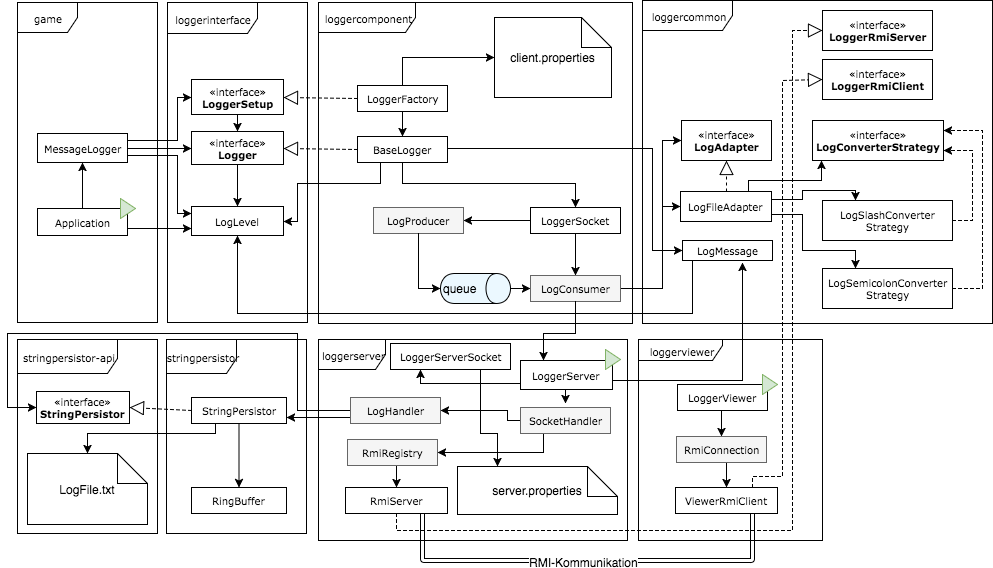

# Systemspezifikationen


**Teammitglieder**:

* Christopher Christensen
* Valentin Bürgler
* Lukas Arnold
* Melvin Werthmüller

**Version**: 2.0

// TODO Update this list

| Rev.	| Datum 		|Autor 		            | Bemerkungen            |  Status     |
|:-----|:-----------|:-----------------------:|:-----------           |:------------|
| 1.1	|				|                         |                       |             |
| 		|				|						      |                       |             |


****


## 1 Systemübersicht

### 1.1 Grobe Systemübersicht
<!---->


Es soll eine Logger-Komponente implementiert werden, die eingebunden in eine bestehende Java-Applikation über Methodenaufrufe Meldungen aufzeichnet, welche dann per TCP/IP an einen Logger-Server gesendet werden, wo sie in einem wohldefinierten Format gespeichert werden. 

Sinnvolle Ereignisse und Situationen, die geloggt werden müssen, sind zu definieren und die entsprechenden Aufrufe in der Java-Applikation zu integrieren.

Die durch ein Interface-Team definierten LogLevels sind sinnvoll und konsistent zu nutzen. Weiter sind die vorgegebenen Schnittstellen Logger, LoggerSetup und StringPersistor einzuhalten. Es müssen sich mehrere Clients mit einem Server verbinden können.

Im späteren Verlauf des Projektes kommen weitere Anforderungen hinzu. 

### 1.2 Vollständige Systemübersicht
Das folgende UML soll eine detaillierte Übersicht über das implementierte System schaffen.
<!---->


Im beiliegenden Dokument DokumentationMessageLogger.pdf werden die einzelnen Komponenten detaillierter beschrieben. Auch die Relationen untereinander werden ausführlich aufgezeigt.

****


## 2 Architektur und Designentscheide
Wir versuchten, möglichst viele bewährte objektorientierte Entwurfsmuster zu verwenden, um eine saubere Architektur unseres MessageLoggers zu erreichen.


### 2.1 Modelle und Sichten
#### Packetdiagramm


#### Klassendiagramm
// TODO Melvin & Vali


### 2.2 Daten (Mengengerüst und Strukturen)
// TODO tbd

### 2.3 Entwurfsentscheide
Wir haben generell über das Projekt hinweg versucht uns an den Clean-Code-Prinzipien zu orientieren. Wir versuchten Vererbung zu vermeiden und das «Favour Composition over Inheritance»-Prinzip zu verfolgen. Dazu strebten wir an die Wiederverwendbarkeit zu erhöhen indem wir das DRY-Prinzip vor Augen hielten und die einzelnen Komponenten so zu gestalten, dass sie nur jeweils eine Aufgabe erfüllen (Seperation of Concerns).

#### Strategie-Pattern
// TODO tbd (nur Strategie Pattern beschreiben, nicht Factory etc. zusammen)

#### Singleton-Pattern
// TODO tbd

#### Fabrikmethode-Pattern
// TODO tbd

#### Adapter-Pattern
Für die Übertragung der `LogMessage` vom `LogHandler` zum `StringPersistor`, welcher danach die `LogMessage` in ein `File` schreibt, verwenden wir das Adapter-Modell. Damit verletzen wir die Wiederverwendbarkeit des `StringPersistor` nicht und können eine angepasste Implementation für den `LogHandler` erstellen. Damit erhalten wir die effektiv gewünschte Zielschnittstelle.

#### Konfigurationsdatei
// TODO tbd, und gehört das auch hierhin?


****


## 3 Schnittstellen
// TODO

### 3.1 Externe Schnittstellen
Die folgenden Schnittstellen wurden uns vorgeschrieben.

*	`Logger`
*	`LoggerSetup`
*	`LogLevel`
*	`LogMessage`
*	`StringPersistor`

### 3.2 Interne Schnittstellen
Die folgenden Schnittstellen wurden von uns vorgeschrieben.

*	`LogWriterAdapter`
*	`config.properties`
*	TCP/IP Schnittstelle

#### Schnittstelle 1, etc.
<!--Genauer Name der Schnittstelle, Kurzbeschreibung der Funktionalität, ggf. Autoren und Besitzer (zwischen wem wurde die Schnittstelle ausgehandelt?), ggf. Version-->

##### Interaktionen
<!--Operationen (z.B. Funktionen, Methoden) oder Datenaustausch (z.B. Nachrichten)
+ Fehlerbehandlung-->

##### Einstellungen
<!--Kann das Verhalten der Schnittstelle oder der Ressourcen verändert oder konfiguriert werden? Mögliche Konfigurationsparameter-->

##### Qualitätsmerkmale
<!--Aussagen über Qualitätsmerkmale, an die Implementierer gebunden sind und auf die sich Nutzer verlassen können. Welche Qualitätseigenschaften wie Verfügbarkeit, Performance, Sicherheit gelten für diese Schnittstelle? Neudeutsch heisst dieser Teil der Schnittstellenbeschreibung Quality-of-Service (QoS) Requirements. Mengengerüste Laufzeit Durchsatz / Datenvolumen Verfügbarkeit-->

##### Entwurfsentscheide
<!--Fragestellungen, Einflüsse, Annahmen, Alternativen und Begründungen für Entwurfsentscheidungen im Zusammenhang mit der Schnittstelle, falls angebracht
Welche Gründe haben zum Entwurf dieser Schnittstelle geführt? Welche Alternativen gibt es, und warum wurden diese verworfen?-->

## 4 Implementation von Komponenten

### 4.1 Einbinden des Loggers auf einem Client
Um den Logger in einer Client-Applikation in Betrieb zu nehmen, muss dafür mit der `LoggerFactory` ein `LoggerSetup`-Objekt geholt werden. Hierfür muss der Factory-Methode `getLoggerSetup` der "Fully Qualified Class Name" einer Klasse übergeben werden, die das `LoggerSetup` Interface implementiert. Über das `LoggerSetup`-Objekt können dann verschiedene `Logger` erstellt werden. 

Zum besseren Verständnis folgt eine Beispiel-Implementierung:

```java
String fqn = "ch.hslu.vsk.g01.loggercomponent.LoggerFactory";
String server = "127.0.0.1";
Integer port = 54321;

try {
	LoggerSetup loggerFactory = LoggerFactory.getLoggerSetup(fqn);
	Logger logger = loggerFactory.createLogger(server, port);
} catch (ClassNotFoundException | IllegalAccessException | InstantiationException e) {
	// Implement error handling here
}
```

#### TCP Connection Client
Der Logger beinhaltet die Funktion `log`, welche eine LogMessage an den Server schickt. Damit die Verbindung asynchron ist, werden zuerst alles zu loggenden Meldungen mit einem eigenen Thread `LogProducer` in eine Queue geschrieben. Desweiteren ist ein Thread `LogConsumer` dafür zuständig, die Queue zu lesen und die Meldungen über eine TCP Verbindung zum Server zu schicken.

#### GameOfLife Einbindung des Loggers
Der GameOfLife Applikation wurde eine neue Klasse hinzugefügt, das `Logger`-Singleton. Um den Logger in Betrieb zu nehmen, wird über die statische `start`-Methode mit der `LoggerFactory` eine spezifische Logger-Implementierung instanziiert. 
Dafür wird die Konfigurationsdatei `config.properties` eingelesen, worin sich der "Fully Qualified Class Name" der `LoggerFactory`, die IP Adresse des Servers und die Portnummer in dieser Reihenfolge befinden muss. Mit dieser Konfigurationsdatei lässt sich die Logger-Komponente austauschen.
Zur Veranschaulichung folgt der mögliche Inhalt von `config.properties`:
```
fqn=ch.hslu.vsk.g01.loggercomponent.LoggerFactory
server=127.0.0.1
port=54321
```
Danach kann der Logger dazu verwendet werden, mit der statischen `log` Methode ein `LogLevel` und entweder ein `String` oder `Throwable` loggen.

Die Applikation wurden ausserdem um Aufrufe dieser `log` Methode mit entsprechenden LogLevels erweitert.
Die `LogLevels` finden folgende Verwendung:

| LogLevel   | Verwendung                               |
| :--------- | :--------------------------------------- |
| `DEBUG`    | Jegliche Information, die in irgendeiner Form nützlich sein könnte, wie Methodenaufrufe, Parameterwerte, etc. |
| `INFO`     | Information über wichtige Ereignisse im Spiel. Jeglicher User-Input wird mit diesem Level geloggt. |
| `WARN`     | Warnungen, wenn etwas passiert, das so nicht geplant war. Das Spiel läuft jedoch weiterhin. |
| `ERROR`    | Fehler, von welchen das System sich wieder erholen kann, wie z.B. Fehler beim Laden/Speichern einer Shape. |
| `CRITICAL` | Fehler, von welchen das System sich nicht erholen kann und beendet werden muss, z.B. bei einer InterruptedException |

#### Logger
Der Logger besteht hauptsächlich aus der Klasse `BaseLogger`, welcher das `Logger`-Interface implementiert. Er bietet die Methode `log` an, welche mit einem `LogLevel` als erstes Argument und einer Nachricht als String, aufgerufen werden kann um etwas zu loggen. Zusätzlich steht noch eine überladene Methode bereit, welche als zweites Argument ein `Throwable` akzeptiert, was es ermöglicht auch Exceptions zu loggen. 

Durch die Instanzierung eines Loggers wird sofort ein `LoggerSocket` erstellt und gestartet. Er enthält eine Queue mit den Meldungen, welche an den Server gesendet werden sollten. Er bietet ausserdem die Methode `queueLogMessage`, welche asynchron eine `LogMessage` in die Queue speichert. Beim Starten des Sockets wird ein `LogConsumer`-Thread gestartet, welcher ständig die Queue abarbeitet und die enthaltenen Nachrichten via einen `ObjectOutputStream` über einen TCP-Socket an den Server sendet. 

### 4.2 Server
Der Server stellt einen Socket bereit und empfängt Meldungen vom Client. Für jede erhaltene Nachricht, wird ein eigener `LogHandler` erstellt, welcher die Meldungen asynchron an den Adapter zum Stringpersistor weitergiebt.

#### LoggerServer
Der LoggerServer besitzt eine `main` Methode, welche für das Starten des Servers verantwortlich ist. Die Klasse bestitz ausserdem drei wichtige lokale Konstanten.

* ExecutorService

Dies ist ein ThreadPool, welcher für die einzelnen LogHandler abarbeitet.

* LogWriterAdapter

Dies ist die Referenz zum Adapter, welche einmalig erzeugt wird und jedem LogHandler zur Verwendung mitgegeben wird.

* ServerSocket

Der Socket ist die Anlaufstelle des Servers. TCP Packete werden damit empfangen. Der LoggerServer erstellt für jede erhaltene Nachricht einen eigenen LogHandler.


#### LoggerServerSocket
Der LoggerServerSocket erstellt einen ServerSocket. Dafür liest er die Konfiguarionen mit der Methode `loadConfigFile()` aus dem Konfigurationsfile. Falls das File `config.properties` nicht existiert, werden standard Werte verwendet. Mit diesen Werten wird ein ServerSocket erstellt. Der Socket wird mit der statischen Methode `create()` erstellt. 

#### LogHandler
Der LogHandler wird vom LoggerServer erstellt. Dieser ist für die asynchron Weitergabe an den LogWriterAdapter verantwortlich. Dementsprechend ist die impementierung auch einfach gehalten. Die Run-Methode sieht wie folgt aus:

```java
public void run() {
	logWriterAdapter.writeLogMessage(message);
}
```

#### LogWriterAdapter
Der LogWriterAdapter stellt die Schnittstelle vom LogHandler zum Stringpersistor her und versteht sich somit als Adapter. Der LogHandler nutzt diesen Adapter, um die LogMessages (unabhängig von der Implementation des StringPersistors) dem StringPersistor zu übergeben. Im Adapter wird das File in das die LogMessages geschrieben werden definiert und in welchem Format die LogMessages gespeichert werden. Der LogWriterAdapter verfügt nur über die Schreibmethode `void writeLogMessages(LogMessage logMessage)`.

#### String Persistor
Der Stringpersistor ermöglicht es dem LogHandler (via LogWriterAdapter) eine Zeitinstanz mit einer Log-Message in ein Log-File zu schreiben. Dazu muss der LogHandler im StringPersistor auch das Log-File an den StringPersistor übergeben mit der Methode `void setFile(final File file)`. Mit der Methode `void save(final Instance instance, final String s)` wird die Zeitinstanz und Log-Message in das zuvor festgelegte Log-File gespeichert. Die Methode `List<PersistedString> get(int i)` liefert die mit dem Parameter `i` gewünschte Anzahl letzten Log-Einträge als `List` des Typs `PersistedString` aus dem Log-File zurück. 


## 5 Verwendung von Komponenten
### 5.1 Ablauf auf dem Client
In der Applikation instanziiert ein `Logger`-Singleton über die `start`-Methode mit der `LoggerFactory` eine spezifische Logger-Implementierung. Dieses `Logger`-Objekt bietet dann Methoden um einen `String` oder ein `Throwable` mit dem entsprechenden `LogLevel` zu loggen. Damit die Verbindung asynchron ist, werden zuerst alle zu loggenden Meldungen mit einem eigenen Thread `LogProducer` in eine Queue geschrieben. Des Weiteren ist ein Thread `LogConsumer` dafür zuständig die Queue zu lesen und die Meldungen über eine TCP Verbindung zum Server zu schicken.

### 5.2 Ablauf auf dem Server
Der Server stellt einen Socket bereit und empfängt Meldungen vom Client. Für jede erhaltene Nachricht wird ein eigener `LogHandler` erstellt, welcher die Meldungen asynchron an den Adapter zum Stringpersistor weitergibt. Der Stringpersistor ermöglicht es dem `LogHandler` (via `LogWriterAdapter`) über die `save`-Methode eine Zeitinstanz mit einer Log-Message in ein Log-File zu schreiben. Das File wird durch einen Aufruf der Methode `setFile` im Logger-Server definiert. 


## 6 Environment
// TODO 


## 7 Testing
Die Funktionalität sollte so gut wie möglich durch Unit-Tests abgedeckt werden. Es macht keinen Sinn die Einbindung ins Game automatisiert zu testen, da viel zu umfangreiche Änderungen notwendig wären. Deswegen werden für die Integration ein paar manuelle Tests definiert, welche regelmässig überprüft werden. Auch die Übertragung der Daten vom Client zum Server wird durch manuelle Test abgedeckt.

### 7.1 Unit Testing

#### LoggerCommon
Zur Verifikation der `LogMessage`-Klasse gibt es einen `LogMessageTest`, welcher das wichtigste Verhalten der Klasse überprüft. 

#### LoggerComponent
Der `BaseLogger` wird durch den `BaseLoggerTest` überprüft. Damit nicht ständig einen TCP-Socket aufgemacht werden muss, verwendet der der Test die Klasse `FakeBaseLogger`, welche von `BaseLogger` abgeleitet wird. Darin wird vorallem die Methode `createSocket` überschrieben und es wird ein `FakeLoggerSocket` erstellt. Ausserdem bietet die abgeleitete Klasse noch ein paar Getters und andere Methoden zur Überprüfung der Daten. Für die Verifikation der anderen Klassen in diesem Modul werden manuelle Tests verwendet, da das Testen einer TCP-Verbindung nicht so trivial ist. 

#### LogWriterAdapter
Der `LogWriterAdapter` hat nur die Methode `void writeLogMessage(LogMessage logMessage)` und diese wird anhand eines JUnit-Tests `LogWriterAdapterTest` getestet. Zuerst wird ein `File`, ein `LogWriterAdapter` und eine `LogMessage` instanziiert. Der `LogMessage` wird ein `LogLevel` und eine Message des Typs `String` übergeben. In einem "PreAssert" mit der Methode `assertEquals(Boolean expected, Boolean actual)` wird geprüft, ob das erstellte File leer ist, da es noch keine `LogMessage` enthalten darf. Danach wird mit der Methode `void writeLogMessage(LogMessage logMessage)` die `LogMessage` in das zuvor erstellte `File` geschrieben. Jetzt kommt der "Assert" wo wieder mithilfe der Methode `assertEquals(Boolean expected, Boolean actual)` geprüft wird, ob das Dokument nun **nicht leer** ist. Am Ende wird das erstellte `File` gelöscht mit der `File`-Methode `delete()`. Der `delete()` kann auskommentiert werden, falls man das Format der im `File` gespeicherten `LogMessage` überprüfen möchte.

#### StringPersistor
Der `StringPersistor` wird anhand eines JUnit-Tests `StringPersistorTest` getestet. Der Test für die Methode `void setFile()` beginnt mit dem Instanzieren eines `StringPersistor`-Objekts und `File`-Objekts. Das `File` wird über die Methode `setFile` dem `File`-Attribut des `StringPersistor` übergeben. Über die Methode `getFile()` wird in der `assertEquals(Boolean expected, Boolean actual)` geprüft, ob es sich beim Rückgabewert, um dasselbe `File` handelt, das übergeben wurde. Die Methode `void save(Instant instant, LogMessage logMessage)` wird nach ähnlichem Verfahren, wie der LogWriterAdapter getestet (siehe Kapitel Unit Testing > LogWriterAdapter). Die Methode `List<PersistedString> get()` wurde noch nicht getestet, da sie noch nicht vollständig implementiert ist.

### 7.2 Manual Testing
#### GameOfLife
Für den Integrationstest der Einbindung in die GameOfLife Applikation wird geprüft, ob die Datei "LogFile.txt" zur Speicherung der Logs auf dem Dateisystem erstellt wurde. Dazu wird zuerst die `main` Methode des `LoggerServer` gestartet. Dann wird die GameOfLife Applikation gestartet. Weiter wird getestet, ob Log-Einträge in "LogFile.txt" vorhanden sind, denn der Aufruf der `init` Methode sollte bereits zu einem Log-Eintrag auf `LogLevel.INFO` mit der Nachricht "Initializing UI..." führen.

#### LoggerComponent & LoggerServer
Der `LoggerServer` wird vorallem mit dem `DemoLogger` getestet. Dieser schickt vier LogMeldungen mit unterschiedlichen `LogLevels` an den Server. Manuell wird dann überprüft, ob die richtigen Meldungen erhalten wurden. Dieser Test dient hauptsächlich zur Überprüfung der TCP-Verbindung und dem LogMessage-Handling in der Queue. Die Teilkomponenten `StringPersistor`und `LogWriterAdapter` haben ihre eigenen JUnit-Tests (siehe Kapitel Unit Testing > StringPersistor und Unit Testing > LogWriterAdapter).
