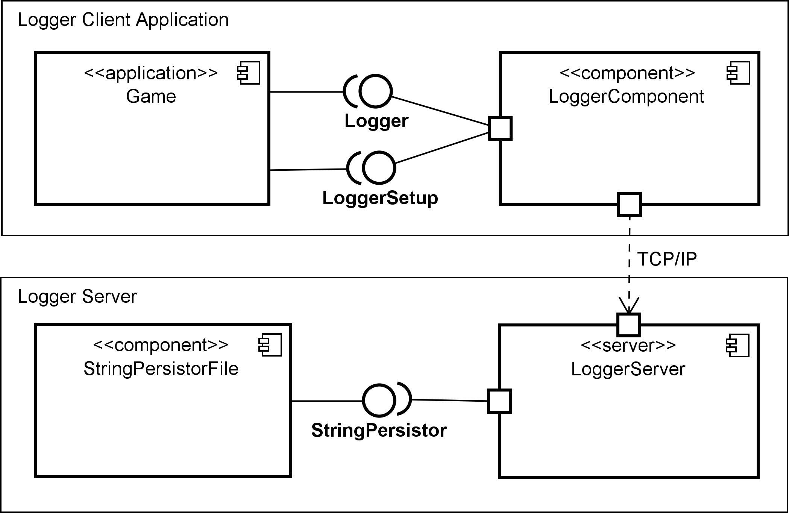
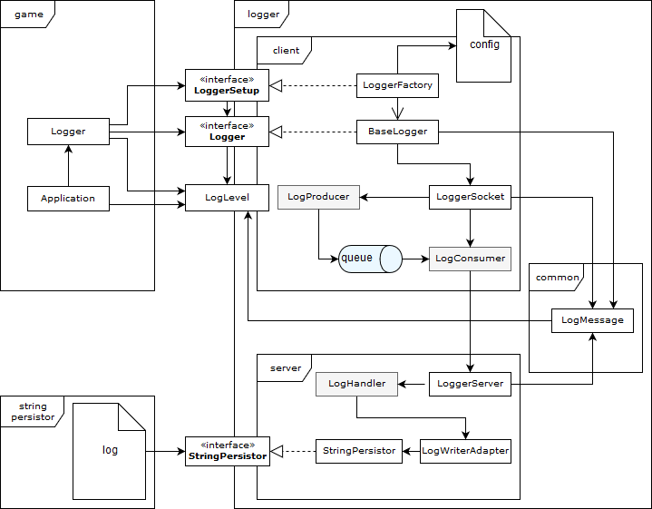

# Dokumentation Message Logger

Version: 1.0

Teammitglieder:

* Christopher Christensen
* Valentin Bürgler
* Lukas Arnold
* Melvin Werthmüller

## Anforderungen


## Übersicht


### Ablauf auf dem Client
Via dem oben gezeigten Beispielcode ist der Logger im Game eingebunden. Damit die Handhabung einfacher ist, wurde dazu ein Singelton erstellt, welches es ermöglicht von überall Hinweise zu loggen. Dieses Singleton instanziert über die `start`-Methode mit der `LoggerFactory` eine spezifische Logger-Implementierung. Dieses `Logger`-Objekt bietet dann Methoden um einen `String` oder ein `Throwable` zu loggen. Damit die Verbindung asynchron ist, werden zuerst alle zu loggenden Meldungen mit einem eigenen Thread `LogProducer` in eine Queue geschrieben. Des Weiteren ist ein Thread `LogConsumer` dafür zuständig die Queue zu lesen und die Meldungen über eine TCP Verbindung zum Server zu schicken.

### Ablauf auf dem Server
Der Server stellt einen Socket bereit und empfängt Meldungen vom Client. Für jede erhaltene Nachricht wird ein eigener `LogHandler` erstellt, welcher die Meldungen asynchron an den Adapter zum Stringpersistor weitergibt. Der Stringpersistor ermöglicht es dem `LogHandler` (via `LogWriterAdapter`) über die `save`-Methode eine Zeitinstanz mit einer Log-Message in ein Log-File zu schreiben. Das File wird durch einen Aufruf der Methode `setFile` im Logger-Server definiert. 

## Implementation

### Einbinden des Loggers auf einem Client
Um den Logger in einer Client-Applikation in Betrieb zu nehmen, muss dafür mit der `LoggerFactory` ein `LoggerSetup`-Objekt geholt werden. Hierfür muss der Methode `getLoggerSetup` ein "Fully-Qualified Class Name" einer Klasse als String übergeben werden, die das `LoggerSetup` Interface implementiert. Über das `LoggerSetup`-Objekt können dann verschiedene Logger erstellt werden. 

Zum besseren Verständnis folgt eine Beispiel-Implementierung:

```java
String fqn = "ch.hslu.vsk.g01.loggercomponent.LoggerFactory";
String server = "127.0.0.1";
Integer port = 54321;

try {
	LoggerSetup loggerFactory = LoggerFactory.getLoggerSetup(fqn);
	Logger logger = loggerFactory.createLogger(server, port);
} catch (ClassNotFoundException | IllegalAccessException | InstantiationException e) {
	// Implement error handling here
}
```

#### TCP Connection Client
Der Logger beinhaltet die Funktion `log`, welche eine LogMessage an den Server schickt. Damit die Verbindung asynchron ist, werden zuerst alles zu loggenden Meldungen mit einem eigenen Thread `LogProducer` in eine Queue geschrieben. Desweiteren ist ein Thread `LogConsumer` dafür zuständig, die Queue zu lesen und die Meldungen über eine TCP Verbindung zum Server zu schicken.

### Server
Der Server stellt einen Socket bereit und empfängt Meldungen vom Client. Für jede erhaltene Nachricht, wird ein eigener `LogHandler` erstellt, welcher die Meldungen asynchron an den Adapter zum Stringpersistor weitergiebt.

#### Adapter
Der Adapter stellt die Schnittstelle zum Stringpersistor her.

#### String Persistor
Der Stringpersistor ermöglicht es dem LogHandler (via LogWriterAdapter) eine Zeitinstanz mit einer Log-Message in ein Log-File zu schreiben. Dazu muss der LogHandler im StringPersistor auch das Log-File an den StringPersistor übergeben mit der Methode `void setFile(final File file)`. Mit der Methode `void save(final Instance instance, final String s)` wird die Zeitinstanz und Log-Message in das zuvor festgelegte Log-File gespeichert. Die Methode `List<PersistedString> get(int i)` liefert die mit dem Parameter `i` gewünschte Anzahl letzten Log-Einträge als `List` des Typs `PersistedString` aus dem Log-File zurück. 

## Testing
Die Funktionalität sollte so gut wie möglich durch Unit-Tests abgedeckt werden. Es macht keinen Sinn die Einbindung ins Game automatisiert zu testen, da viel zu umfangreiche Änderungen notwendig wären. Deswegen werden für die Integration ein paar manuelle Tests definiert, welche regelmässig überprüft werden. Auch die Übertragung der Daten vom Client zum Server wird durch manuelle Test abgedeckt. 
